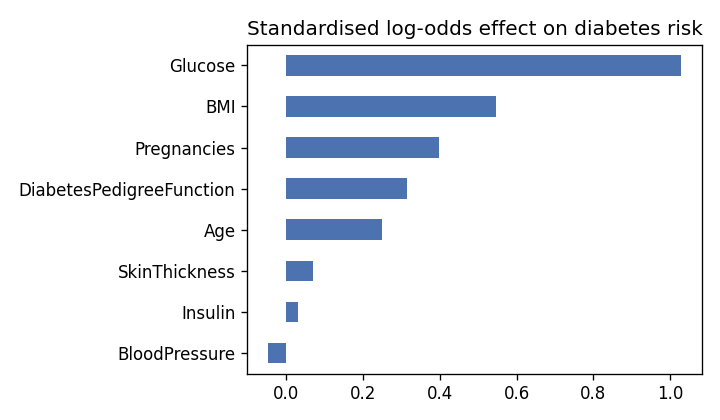

# Diabetes Risk Screening (Pima Indians Diabetes Dataset)

How well can routine measurements (glucose, BMI, age, pregnancies, blood pressure, insulin, skin thickness and a family-history score)
flag women at risk of diabetes for follow-up testing?

## Results (held-out test set, 154 women)

| Model (selected by 5-fold CV ROC-AUC) | ROC-AUC | Recall (diabetic cases caught) | Precision | Accuracy |
|---|---|---|---|---|
| Logistic regression | **0.874** | 72% | 65% | 77% |

Cross-validated ROC-AUC on the training set: logistic regression 0.83, random forest 0.82, gradient boosting 0.82. The simple model is as good as the complex ones.

**Choosing a screening threshold.** Missing a diabetic patient costs more than an extra blood test, so the decision threshold matters more than the model:

| Threshold | Recall | Precision | Flagged for follow-up (of 154) |
|---|---|---|---|
| 0.3 | 96% | 58% | 89 |
| 0.4 | 85% | 63% | 73 |
| 0.5 (default) | 72% | 65% | 60 |

At a threshold of 0.4, 85% of diabetic cases are caught while flagging 73 of 154 women.



## Method

- **Impossible zeros treated as missing.** Glucose, blood pressure, skin thickness, insulin and BMI readings of 0 become NaN
  (insulin is 0 in 49% of rows and skin thickness in 30%). They're imputed with the training-set median *inside* the model pipeline.
- **Stratified 80/20 split**, then 5-fold cross-validation on the training set to pick between logistic regression, random forest and
  gradient boosting. The test set is scored once.
- Screening metrics are reported: ROC-AUC, recall and precision, plus a threshold table.

## Corrections to the first version

The previous README reported **94% accuracy**. The notebook itself showed **81.8% test accuracy**. It also:
- filled missing values using the whole dataset before splitting;
- dropped features based on a correlation plot;
- referenced a `grid_search` object that was never defined, so it couldn't run top to bottom.

The original notebook is kept in `archive/`.

## Run it

```bash
pip install -r requirements.txt
# put diabetes.csv in data/ (see data/README.md)
jupyter nbconvert --to notebook --execute diabetes_screening.ipynb
```

Tools: pandas, scikit-learn (pipelines, cross-validation), matplotlib.
